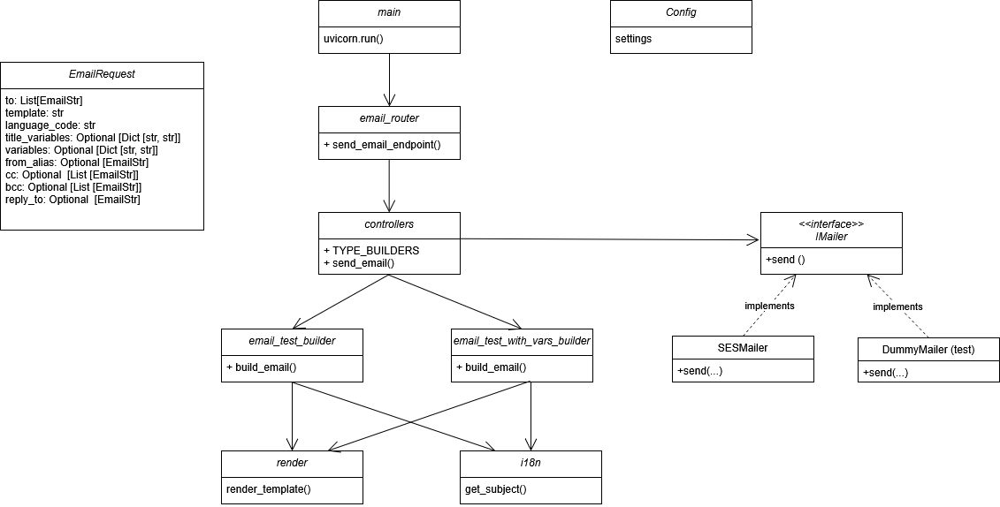

# 📧 FastAPI Email Service

This project is a microservice built with **FastAPI** that allows to send emails using AWS SES. It is designed to be flexible, extensible and easy to test.

## 🚀 Features

- Email sending using **Amazon SES** (you can add other email sending services by inhereting the IMailer interface)
- HTML template support with **Jinja2**
- Dynamic translations with body and subject variables (i18n with JSON)
- Testing with `pytest` and `DummyMailer` to avoid real mails
- Container-ready with Docker

## 🧱 Architecture Overview



## 📂 Project structure

```
email_service/
├── app/
│   ├── api/
│   ├── templates/
│   ├── main.py
│   ├── config.py
│   └── ...
├── tests/
│   └── test_send_email_endpoint.py
├── .env
├── Dockerfile
├── requirements.txt
└── README.md
```

## 🧪 Testing

To run the tests:

```bash
pytest
```

## 🐳 Docker

```bash
docker build -t fastapi-email-service .
docker run -p 8000:8000 fastapi-email-service
```


## 🔒 Environment variables (.env)

Make sure to define the variables in .env.example

## 🧩 Add New Email Templates

To create a new email template with subject and HTML body:

1. **Add the template HTML**  
   - Create a new file at:  
     `app/templates/{language_code}/{template_name}.html`

2. **Add the subject translation**  
   - Edit the corresponding file in:  
     `app/api/email/locales/{language_code}.json`  
   - Add an entry like:  
     ```json
     "welcome_email": "Welcome, {name}!"
     ```

3. **Create a new type builder**  
   - Add a file like:  
     `app/api/email/types/email_welcome_builder.py`
   - Define an `async def build_email(language, title_variables, variables)` function.

4. **Register the new builder in `controllers.py`**  
   ```python
   from app.api.email.types import email_welcome_builder

   
   TYPE_BUILDERS = {
       "welcome_email": email_welcome_builder.build_email,
       ...
   }
   ```

## 📬 Example Usage

Now you can use the new template via `POST` to `/api/send-email`:

```http
POST /api/send-email
Content-Type: application/json
```

```json
{
  "to": ["test@test.com"],
  "template": "test_email_with_vars",
  "language_code": "es",
  "title_variables": {
    "name": "Test",
    "surname": "Email"
  },
  "variables": {
    "name": "Test",
    "surname": "Email"
  }
}
```

Expected response:

```json
{
  "status": "sent",
  "message_id": "xyz-12345"
}
```